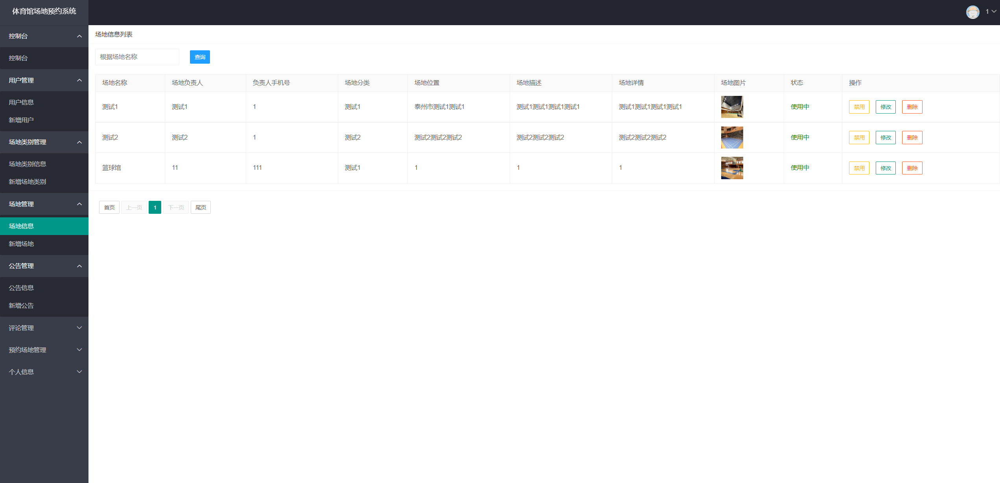
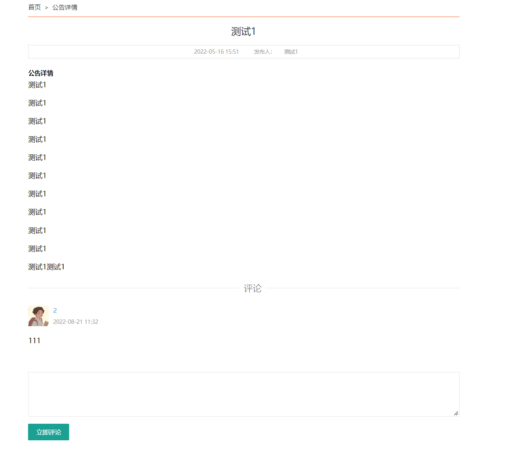
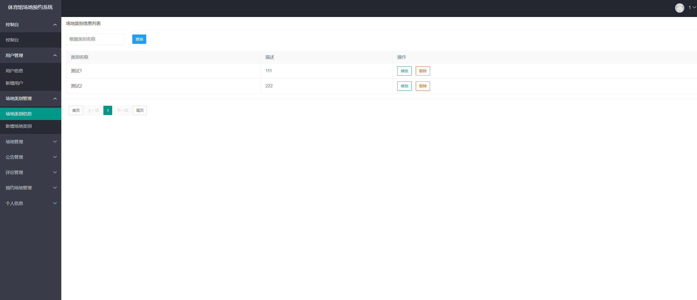
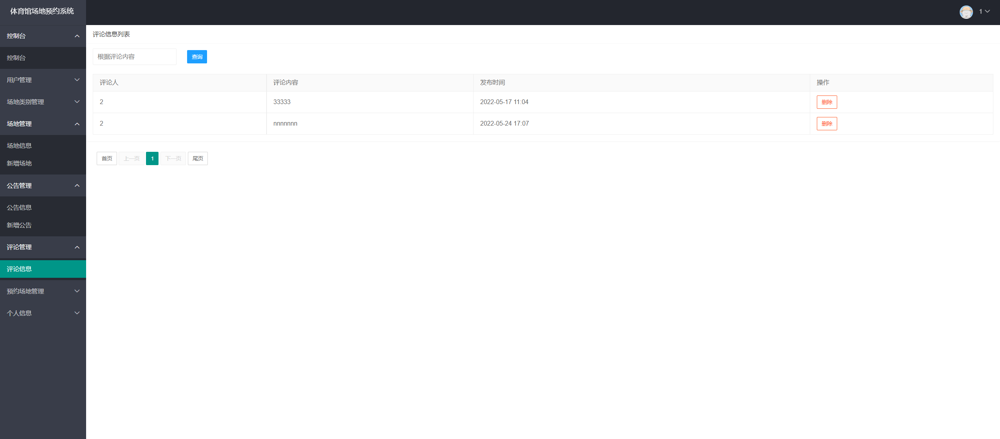
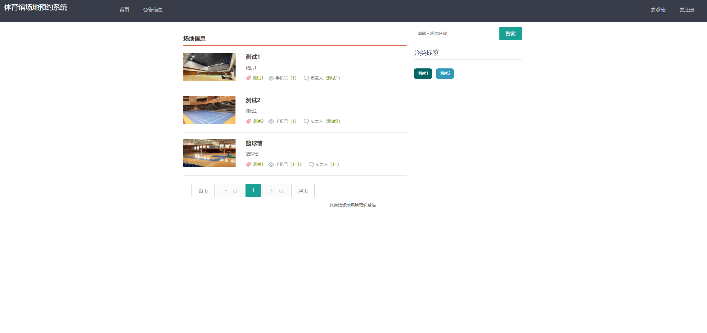

基于Springboot的体育馆场地预约系统
=
### 完整代码获取地址：从戎源码网 ([https://armycodes.com/](https://armycodes.com/))
### 作者微信：19941326836  QQ：952045282 
### 承接计算机毕业设计、Java毕业设计、Python毕业设计、深度学习、机器学习
### 选题+开题报告+任务书+程序定制+安装调试+论文+答辩ppt 一条龙服务
### 所有选题地址https://github.com/nature924/allProject

一、项目介绍
---
基于Springboot框架实现的体育馆场地预约系统包含两种角色：管理员、用户,系统分为前台和后台两大模块，主要功能如下。

### 【管理员模块】：
1. 控制台：管理员登录后可以进入系统的控制台，查看系统的整体情况和统计数据。
2. 用户管理：管理员可以管理用户信息，包括查看、编辑、删除等操作。
3. 场地类别管理：管理员可以管理场地类别，包括查看、编辑、删除等操作。
4. 场地管理：管理员可以管理具体的场地，包括查看、编辑、删除等操作。
5. 公告管理：管理员可以管理系统的公告信息，包括发布、编辑、删除等操作。
6. 评论管理：管理员可以管理用户的评论，包括查看、删除等操作。
7. 预约场地管理：管理员可以管理用户的场地预约，包括查看、审核、取消等操作。

### 【用户模块】：
1. 用户中心：用户可以管理自己的个人信息，包括查看、编辑等操作。
2. 我的评论：用户可以查看和管理自己的评论，包括查看、编辑、删除等操作。
3. 我的预约：用户可以查看和管理自己的场地预约信息，包括查看、取消等操作。

二、项目技术
---
- 编程语言：Java
- 数据库：MySQL
- 项目管理工具：Maven
- 前端技术：VUE、HTML、Jquery、Bootstrap
- 后端技术：Spring、SpringMVC、MyBatis

三、运行环境
---
- 操作系统：Windows、macOS都可以
- JDK版本：JDK1.8以上都可以
- 开发工具：IDEA、Ecplise、Myecplise都可以
- 数据库: MySQL5.7以上都可以
- Tomcat：任意版本都可以
- Maven：任意版本都可以

四、运行截图
---
### 论文截图：

### 程序截图：

